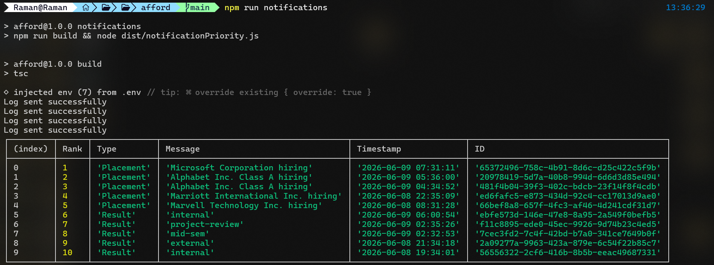
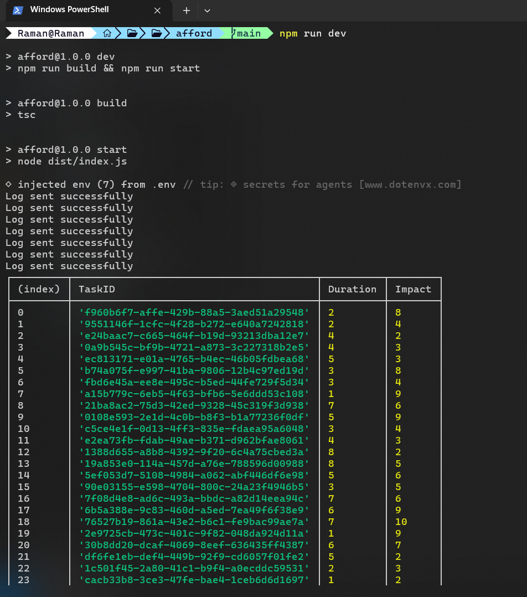
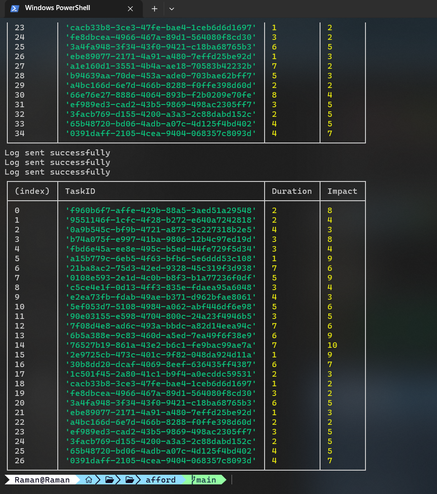

# Notification Priority System

This project fetches and displays the most important notifications for a user based on a smart priority system. 

## How it Works

1. **Fetching Notifications**: The system securely connects to a backend server and downloads a list of your recent notifications.
2. **Assigning Priority**: Each notification is given a "weight" or importance level based on its category:
   - **Placement**: Highest Priority (Weight = 3)
   - **Result**: Medium Priority (Weight = 2)
   - **Event**: Normal Priority (Weight = 1)
3. **Sorting by Time**: If two notifications have the exact same priority level (for example, two "Result" notifications), the system looks at the time they were received. The newer notification is considered more important.
4. **Picking the Best**: Instead of showing you an overwhelming list of everything, it uses an efficient computer science method (a *Min Heap*) to figure out and keep only the **Top 10** most important notifications.

## What it Outputs

The program outputs the top 10 notifications, neatly formatted as a table in your terminal or console. 

The output table includes the following details:
- **Rank**: The position of the notification from 1 to 10 (1 being the absolute most important).
- **Type**: The category of the notification (Placement, Result, or Event).
- **Message**: The actual text content of the notification.
- **Timestamp**: The exact date and time the notification was sent.
- **ID**: A unique identifier for the notification in the database.

### Example Output

Here is what the notifications output looks like when you run the system:

---

# Vehicle Scheduler System

This project also includes a smart scheduler for vehicle maintenance. It figures out the best way to use the limited time mechanics have to fix vehicles.

## How it Works

1. **Getting Information**: The system securely downloads a list of all "Depots" (garages where mechanics work) and a list of "Vehicles" (that need fixing).
2. **Checking Available Time**: For each depot, it checks how many "Mechanic Hours" are available to do work.
3. **Optimizing the Schedule**: It looks at all the vehicles that need work, how long each task will take (in hours), and how much "Impact" (benefit) doing that task will bring. 
4. **Making the Best Choice**: Like a puzzle, it picks the combination of vehicle tasks that provides the absolute **highest total impact** without going over the available mechanic hours at that depot.

## What it Outputs

For every depot, the program outputs:
- The Depot ID and the available Mechanic Hours.
- The **Total Impact** score (the total benefit achieved from the selected tasks).
- A neatly formatted table of the **Selected Tasks** that the mechanics should perform.

The table includes details like the vehicle ID, the type of task, the hours it takes, and the impact score of that specific task.

### Example Outputs

Here is what the vehicle scheduler outputs look like when you run the program:

---

# System Logging

Both the Notification and Vehicle Scheduler systems use a built-in "logger" to keep track of what's happening behind the scenes. 

## How Logging Works

1. **Tracking Progress**: As the program runs, it automatically creates checkpoints (for example, recording when it is "Authenticating..." or "Fetching data...").
2. **Remote Storage**: Instead of just printing these updates to your local screen, it securely sends these log messages over the internet to a central logging server.
3. **Catching Errors**: If something goes wrong—like a failed login or bad data—the logger catches the error and immediately sends an "error alert" to the remote server. This allows developers to easily look up what went wrong and fix the problem without needing to ask the user.
